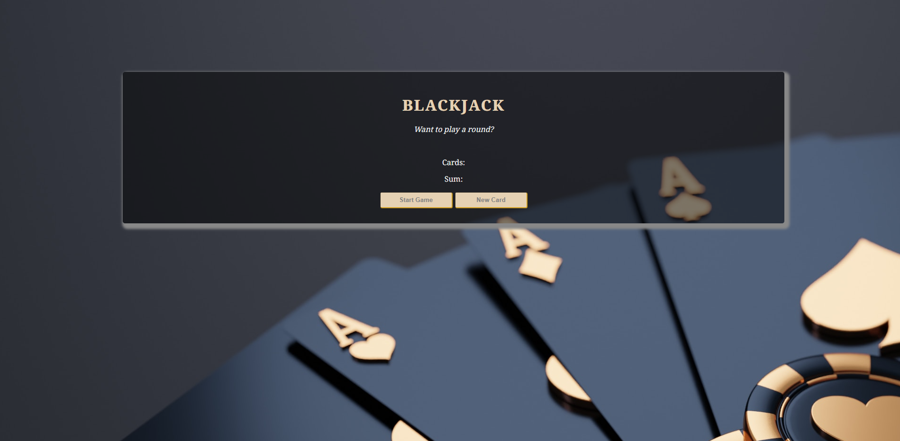

# Scrimba- BlackJack

## Table of contents

- [Overview](#overview)
  - [The challenge](#the-challenge)
  - [Screenshot](#screenshot)
  - [Links](#links)
- [My process](#my-process)
  - [Built with](#built-with)
  - [What I learned](#what-i-learned)
  - [Continued development](#continued-development)
  - [Useful resources](#useful-resources)

## Overview
Created a Blackjack game with JavaScript

### The challenge

Users should be able to:

- Play a functional Blackjack game 
- Be able to use the webpage on mobile or desktop sizes

### Screenshot

### Links

- Solution URL: https://github.com/Jud1th1/blackjack-game
- Live Site URL: https://remarkable-blackjack-game.netlify.app/

## My process
-	To begin with I followed the tutorial to lay out my html and css
-	There were JS practice throughout to help understand the concepts we would be using which helped with understanding my JS set up
-	We started off by creating two variables for our cards and and setting the sum of the two cards
-	We crated blackjack rules such as:
-	if less than or equal to 20 -> "Do you want to draw a new card? 🙂"
-	// else if exactly 21 -> "Wohoo! You've got Blackjack! 🥳"
-	// else -> "You're out of the game! 😭"
-	Then we introduced a new variable that keeps the state of the game so we know if our player has Blackjack 
-	If our player is ‘alive’ we assign a variable to true to allow the ‘dealer’ to continue dealing cards
-	We reassigned the message variable to the string to log it out
-	Then we crated a startGame function and started to set up the game display, so allowing JS to store messages, display them, find sum, and display our cards using functions and getElementby Id
-	We created a new Card button that would be able to draw random cards as created a for loop that renders out all the cards instead of just two 
-	We fixed the new card function to stop it from letting user to continue getting cards after a loss
-	Then finally we added another variable called chips to the game which we grouped with the players name – so we created an an object to store player data, gave it two keys, name and chips, and set their values
-	Then I added some final styling edits such as a new image to the background and a box shadow around the container of my game. I changed some colors and fonts and made sure the game was responsive for mobile as well. 

### Built with

- HTML
- CSS
- Javascript
- Desktop-mobile workflow

### What I learned

-	I learned how build a game with JS
-   I learned how to create arrays, use for loops, return values, objects, etc. 

### Continued development

I plan to practice more JavaScript projects 

### Useful resources

- https://scrimba.com/playlist/p3py7U7

